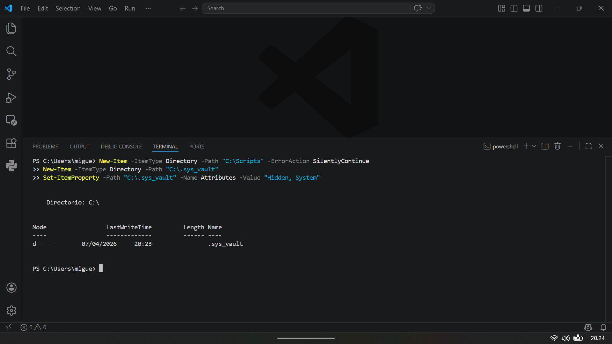
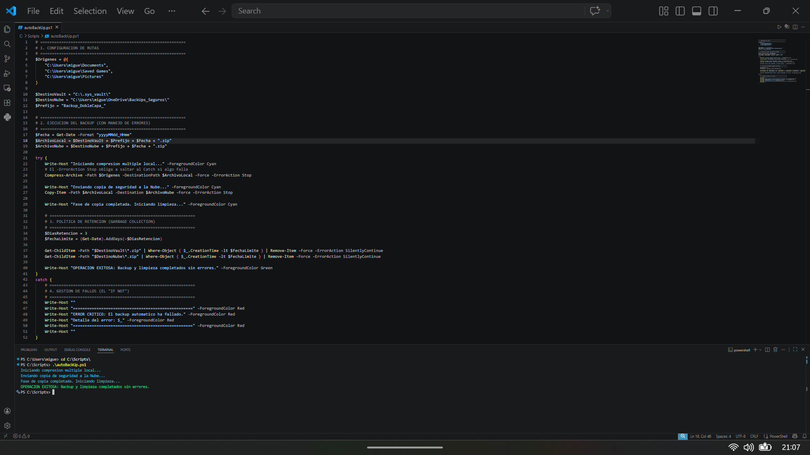

# 🛡️ Proyecto: Arquitectura de Backups de Doble Capa (Ransomware-Resistant)

Este proyecto documenta la creación e implementación de un sistema de copias de seguridad automatizado en Windows 11 mediante PowerShell. Está diseñado bajo principios de ciberseguridad defensiva para resistir infecciones por Ransomware combinando ocultación local (Vault), versionado en la nube y políticas de retención, incluyendo manejo avanzado de errores.

## 🏗️ 1. Arquitectura de la Solución
El script automatizado se ejecuta mediante el Programador de Tareas de Windows de forma silenciosa y con privilegios elevados, realizando tres acciones secuenciales:

1. **Capa Local (Vaulting):** Comprime múltiples directorios críticos utilizando Arrays y envía el bloque de datos a `C:\.sys_vault`, un directorio endurecido con los atributos `Hidden` y `System` para evadir escaneos superficiales de malware.
2. **Capa Cloud (Sincronización & Versionado):** Despliega una réplica del archivo en un directorio sincronizado con Microsoft OneDrive, aprovechando la funcionalidad de "Historial de Versiones" del proveedor para recuperación ante cifrado.
3. **Gestión de Almacenamiento (Retention Policy):** Incorpora una rutina de recolección de basura (*Garbage Collection*) configurada a 3 días. El sistema purga automáticamente los archivos obsoletos.
4. **Resiliencia (Error Handling):** Implementa bloques `Try/Catch` para asegurar que cualquier fallo en la lectura/escritura sea capturado y reportado, evitando falsos positivos de finalización.

## 💻 2. Código Fuente (PowerShell)

```powershell
# ==============================================================
# 1. CONFIGURACION DE RUTAS
# ==============================================================
$Origenes = @(
    "C:\Users\migue\Documents",
    "C:\Users\migue\Saved Games",
    "C:\Users\migue\Pictures"
)

$DestinoVault = "C:\.sys_vault\"
$DestinoNube = "C:\Users\migue\OneDrive\Backup_Seguros\"
$Prefijo = "Backup_DobleCapa_"

# ==============================================================
# 2. EJECUCION DEL BACKUP (CON MANEJO DE ERRORES)
# ==============================================================
$Fecha = Get-Date -Format "yyyyMMdd_HHmm"
$ArchivoLocal = $DestinoVault + $Prefijo + $Fecha + ".zip"
$ArchivoNube = $DestinoNube + $Prefijo + $Fecha + ".zip"

try {
    Write-Host "Iniciando compresion multiple local..." -ForegroundColor Cyan
    Compress-Archive -Path $Origenes -DestinationPath $ArchivoLocal -Force -ErrorAction Stop
    
    Write-Host "Enviando copia de seguridad a la Nube..." -ForegroundColor Cyan
    Copy-Item -Path $ArchivoLocal -Destination $ArchivoNube -Force -ErrorAction Stop

    Write-Host "Fase de copia completada. Iniciando limpieza..." -ForegroundColor Cyan

    # ==============================================================
    # 3. POLITICA DE RETENCION (GARBAGE COLLECTION)
    # ==============================================================
    $DiasRetencion = 3
    $FechaLimite = (Get-Date).AddDays(-$DiasRetencion)
    
    Get-ChildItem -Path "$DestinoVault\*.zip" | Where-Object { $_.CreationTime -lt $FechaLimite } | Remove-Item -Force -ErrorAction SilentlyContinue
    Get-ChildItem -Path "$DestinoNube\*.zip" | Where-Object { $_.CreationTime -lt $FechaLimite } | Remove-Item -Force -ErrorAction SilentlyContinue

    Write-Host "OPERACION EXITOSA: Backup y limpieza completados sin errores." -ForegroundColor Green
}
catch {
    # ==============================================================
    # 4. GESTION DE FALLOS
    # ==============================================================
    Write-Host ""
    Write-Host "===================================================" -ForegroundColor Red
    Write-Host "ERROR CRITICO: El backup automatico ha fallado." -ForegroundColor Red
    Write-Host "Detalle del error: $_" -ForegroundColor Red
    Write-Host "===================================================" -ForegroundColor Red
    Write-Host ""
}
```
## 📸 3. Evidencias de Ejecución y Automatización

### 1. Preparación del Entorno (Vault Oculto)
*Ejecución de comandos en PowerShell con privilegios de Administrador para desplegar el directorio de trabajo y la bóveda local (`.sys_vault`). Se aplican atributos de seguridad (`Hidden`, `System`) para invisibilizar el contenedor de backups ante el usuario y malware superficial.*



---

### 2. Ejecución Exitosa en Entorno de Desarrollo (VS Code)
*Se observa la ejecución del script con el manejo de errores activo y la política de ejecución controlada, finalizando con éxito la compresión y la política de retención.*



---

### 3. Persistencia y Automatización (Task Scheduler)
*Configuración del Programador de Tareas de Windows para la ejecución silenciosa (`-WindowStyle Hidden`) y con privilegios de `SYSTEM` o Administrador.*


